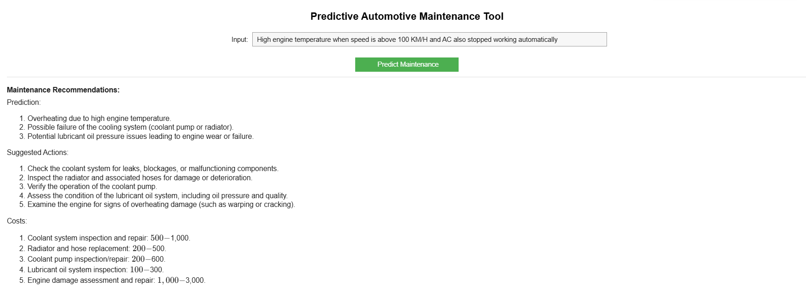

# Smart Vehicle Maintenance Assistant Using RAG and Large Language Models

This repository presents an intelligent automotive maintenance assistant built using Retrieval-Augmented Generation (RAG), Natural Language Processing (NLP), and Large Language Models (LLMs). The system is designed to analyze vehicle-related issues, retrieve relevant maintenance knowledge, and generate context-aware diagnostic and maintenance recommendations.

The project combines semantic retrieval with generative AI to create an intelligent assistant capable of supporting predictive automotive maintenance and troubleshooting tasks.

The implementation is provided in a Jupyter Notebook environment and is compatible with Google Colab and local systems.

## Overview

Predictive maintenance plays an important role in reducing vehicle failures, maintenance costs, and unexpected downtime in the automotive industry.

This project integrates:

- Natural Language Processing (NLP)
- Retrieval-Augmented Generation (RAG)
- Large Language Models (LLMs)
- Semantic Search using FAISS
- Transformer-based embeddings

to create a smart vehicle maintenance assistant capable of understanding automotive issues and generating intelligent maintenance guidance.

The system retrieves relevant maintenance records and combines them with an LLM to generate detailed diagnostic responses.

The project mainly focuses on automotive maintenance scenarios related to Internal Combustion Engine (ICE) vehicles.

## Features

- Retrieval-Augmented Generation (RAG) architecture
- NLP-based text preprocessing
- Semantic similarity search using FAISS
- Integration with Large Language Models
- Vehicle issue analysis and diagnostics
- Predictive maintenance recommendations
- Repair urgency estimation
- Maintenance guidance generation
- Context-aware response generation
- Interactive notebook-based workflow
- Real-time automotive query support

## Dataset

The project uses automotive maintenance and repair-related textual data to build the retrieval knowledge base.

The dataset contains maintenance records, repair descriptions, issue reports, troubleshooting details, and automotive diagnostic information used for semantic retrieval and intelligent response generation.

### Sample Query Examples

- "Engine knocking sound during acceleration"
- "Vehicle overheating after long drives"
- "Brake pedal feels soft while driving"
- "Battery draining overnight"
- "Check engine light blinking continuously"

## Technologies Used

- Python
- Jupyter Notebook
- Google Colab
- Pandas
- NumPy
- FAISS
- LangChain
- Hugging Face Transformers
- Sentence Transformers
- OpenAI / LLM APIs
- Scikit-learn
- Matplotlib

## Methodology

### 1. Data Collection and Preprocessing

Automotive maintenance-related textual data is collected and cleaned before building the retrieval system. NLP preprocessing techniques such as tokenization, stopword removal, lowercasing, and normalization are applied.

### 2. Embedding Generation

Transformer-based embedding models are used to convert textual maintenance records into dense vector representations.

These embeddings help the system understand semantic relationships between user queries and automotive maintenance information.

### 3. Vector Database Construction

FAISS is used to create a vector database for efficient similarity search and semantic retrieval.

The system retrieves the most relevant maintenance records based on the user's vehicle-related query.

### 4. Retrieval-Augmented Generation (RAG)

The retrieved maintenance context is passed to a Large Language Model to generate intelligent and context-aware responses.

The RAG framework improves response quality by grounding the LLM with external automotive maintenance knowledge.

### 5. Vehicle Diagnostics and Maintenance Assistance

The system analyzes user vehicle-related problems and generates:

- Possible issue identification
- Maintenance recommendations
- Repair urgency estimation
- Failure risk insights
- Troubleshooting guidance

### 6. Interactive Query Interface

An interactive query-response workflow is included in the notebook. Users can enter vehicle symptoms and receive AI-generated maintenance suggestions and diagnostic insights in real time.

## Demo

## System Workflow

The project follows the following pipeline:

1. User enters a vehicle-related issue query
2. NLP preprocessing is applied
3. Query embeddings are generated
4. FAISS retrieves semantically relevant maintenance records
5. Retrieved context is passed to the LLM
6. LLM generates diagnostic and maintenance recommendations
7. Final AI-generated response is displayed to the user

## Applications

- Predictive automotive maintenance
- Vehicle troubleshooting systems
- Intelligent repair recommendation tools
- Automotive AI assistants
- Fleet maintenance support systems
- Smart workshop assistance
- Automotive diagnostic analysis

## Results and Insights

The project demonstrates how semantic retrieval and Large Language Models can be combined to create intelligent automotive maintenance assistants.

The retrieval system improves contextual relevance, while the LLM generates detailed and human-like maintenance guidance.

The framework can support early issue detection, reduce maintenance uncertainty, and improve automotive diagnostic workflows.

## Conclusion

This project presents a smart automotive maintenance assistant powered by Retrieval-Augmented Generation and Large Language Models. By combining semantic retrieval, transformer embeddings, FAISS vector search, and generative AI, the system provides context-aware vehicle diagnostics and maintenance recommendations.

The project demonstrates the practical application of AI, NLP, and LLM technologies in automotive maintenance and predictive analytics.

## Repository Summary

An intelligent automotive maintenance assistant that uses Retrieval-Augmented Generation, NLP, FAISS vector search, and Large Language Models to provide context-aware vehicle diagnostics and predictive maintenance recommendations.
